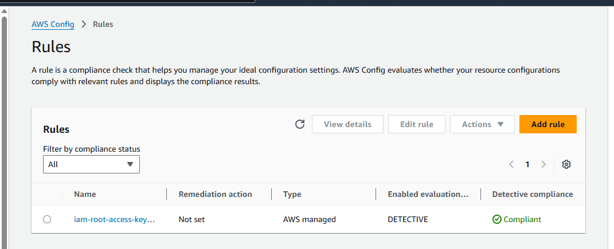

# AWS Config Rule: IAM Root Access Key Check 

This document outlines the implementation and findings of an **AWS Config managed rule** used to enforce IAM security best practices within the **"African Fintech IAM Guardrails"** project.

---

## 🎯 Purpose

Enforcing continuous compliance in cloud environments is essential, especially in fintech. This AWS Config rule is designed to **detect and alert when the AWS root user has active access keys**, which poses a serious security risk and goes against AWS best practices.

---

## ✅ Rule Details

- **Rule Name:** `iam-root-access-key-check`
- **Type:** AWS Managed Rule
- **Description:** Evaluates whether the root user in your AWS account has active access keys. If such keys exist, the resource is marked **NONCOMPLIANT**.
- **Trigger Type:** Configuration changes  
  *(AWS Config evaluates resources when relevant changes occur automatically)*

---

## 🔎 Initial Compliance Status

- **Status:** `COMPLIANT`

**Explanation:**
- **COMPLIANT:** AWS root user has no active access keys, this aligns with AWS security best practices.
- **NONCOMPLIANT:** Indicates active root access keys exist. This is a high risk vulnerability. Immediate action is required:
  - Delete the keys.
  - Ensure the root user is only used for essential tasks like billing or account setup.
  
> ✅ For this project, the account was marked **COMPLIANT**, meaning no active root access keys were detected.

---

## 💡 Why This Matters for Fintech IAM

- **Reduces Critical Risk Surface:** Because root access keys offer unrestricted access, they are a prime target for attackers. Removing them helps contain potential damage and strengthens your overall security posture.
- **Enables Automated Governance:** Ensures root level IAM risks are continuously monitored without manual checks.
- **Supports Audit & Compliance:** Demonstrates security maturity to auditors, investors, and compliance teams, vital in regulated fintech environments.

---

## 📸 Screenshot

Visual proof of compliance is included here:

---

## 🧠 Summary

This AWS Config rule acts as an automated guardrail, helping enforce zero tolerance for root level credential misuse. It's part of a larger strategy to build a secure, compliant, and investor-ready fintech infrastructure in the cloud.
