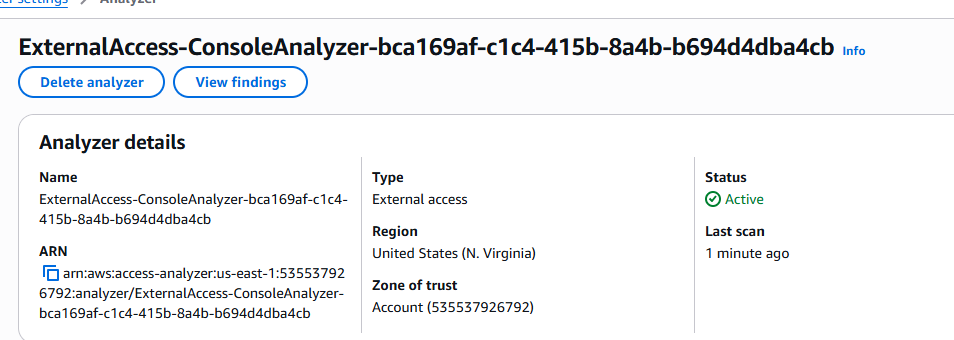

#  IAM Access Analyzer: External Access Review

This document outlines the **setup, benefits, and initial scan results** of enabling **AWS IAM Access Analyzer** as part of the `African Fintech IAM Guardrails` project. This tool is essential for identifying cloud resources, like **S3 buckets, IAM roles, SQS queues, KMS keys, and Secrets Manager secrets**, that may be  unintentionally exposed to **unauthorized or third-party identities** outside your AWS account or organization.

---

##  Purpose of IAM Access Analyzer in FinTech

In a FinTech context, where **customer data, financial records, and critical infrastructure** reside in the cloud, **unauthorized and third-party access detection** becomes absolutely essential. IAM Access Analyzer supports:

-  **Detection of Public and Cross-Account Access**  
  Automatically scans resource-based policies for permissions granted to principals outside your AWS account or AWS Organization.

-  **Prevention of Data Leaks**  
  Flags unintended exposure to help mitigate risk before breaches occur.

-  **Compliance with Regulatory Standards**  
  Assists with meeting controls in **GDPR**, **NDPR**, **PCI DSS**, and other FinTech compliance frameworks.

-  **Audit and Security Visibility**  
  Delivers real time visibility into which AWS resources are accessible outside your trusted account or organization.
---

##  Configuration Summary

| Setting          | Value            |
|------------------|------------------|
| **Service**       | IAM Access Analyzer |
| **Analyzer Type** | Account-level (default) |
| **Region**        | `us-east-1` |

---

##  Initial Findings

IAM Access Analyzer scanned all resource policies upon activation.

-  **Number of Findings:** `0`
-  **Summary:**  
  No external access was detected at the time of the scan. This confirms a **secure baseline** for currently configured resources.

> _“No external findings were immediately detected, indicating a well configured environment and limited external exposure.”_

> _Note: Future scans may uncover findings as infrastructure changes or integrations evolve. Continuous monitoring is recommended._

---

##  Why This Matters in FinTech Cloud Security

| Benefit                           | Impact                                                                 |
|----------------------------------|------------------------------------------------------------------------|
| **Data Protection**              | Minimizes risk of exposing sensitive financial data to the public or third parties |
| **Proactive Compliance**         | Helps meet legal and industry requirements for cloud access control    |
| **Access Control Best Practices**| Shifts FinTech teams from reacting to incidents to continuously hardening access surfaces against evolving threats |
| **Continuous Visibility**        | Maintains situational awareness across all regions and environments    |

---

##  Screenshot

View a snapshot of the dashboard interface and result summary:

> _File: `iam-access-analyzer-dashboard.png`_

---

